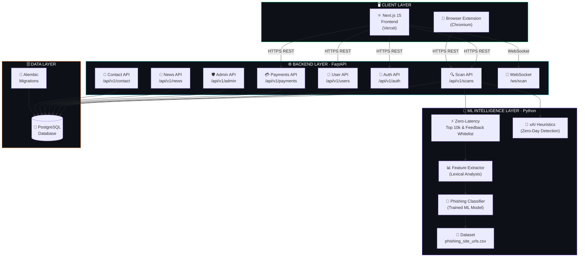

<div align="center">

<!-- ═══════════════════════════════════════════════════════════════ -->
<!--                        HERO SECTION                           -->
<!-- ═══════════════════════════════════════════════════════════════ -->


<a href="https://phishx-app.vercel.app/" target="_blank">
  
</a>

<br/><br/>

<!-- Animated Typing Subtitle -->
<a href="https://git.io/typing-svg">
  
</a>

<br/><br/>

<!-- ─── BADGES ─────────────────────────────────────────────────── -->

<a href="https://phishx-app.vercel.app/" target="_blank">
  
</a>
<a href="https://phishx-vqib.onrender.com/docs" target="_blank">
  
</a>
<a href="https://phishx-app.vercel.app/" target="_blank">
  
</a>
<a href="./LICENSE" target="_blank">
  
</a>

<br/><br/>

<a href="https://phishx-app.vercel.app/" target="_blank">
  
</a>
<a href="https://phishx-app.vercel.app/" target="_blank">
  
</a>
<a href="https://phishx-app.vercel.app/" target="_blank">
  
</a>
<a href="https://phishx-app.vercel.app/" target="_blank">
  
</a>
<a href="https://phishx-app.vercel.app/" target="_blank">
  
</a>

<br/><br/>

> **PhishX v2.0** is a sophisticated, full-stack cybersecurity platform engineered to neutralize phishing threats in real-time.
> Now powered by **Next.js 15**, a real-time **WebSocket** scanning engine, **xAI** heuristic analysis, and a GDPR/DPDP compliant legal framework —
> PhishX delivers enterprise-grade URL threat intelligence wrapped in a stunning, production-ready interface.

</div>

---

<!-- ═══════════════════════════════════════════════════════════════ -->
<!--                      FEATURES CARD GRID                       -->
<!-- ═══════════════════════════════════════════════════════════════ -->

## ✦ Core Capabilities

<table>
  <tr>
    <td align="center" width="33%">
      <br/>
      
      <br/><br/>
      <strong>🧠 AI-Driven Threat Detection</strong>
      <br/><br/>
      <sub>Custom ML model combined with a <strong>Zero-Latency Offline Top 10k Whitelist</strong> and a <strong>Dynamic Community Feedback loop</strong>. Identifies zero-day phishing attempts while organically adapting to prevent false positives — completely free of charge.</sub>
      <br/><br/>
    </td>
    <td align="center" width="33%">
      <br/>
      
      <br/><br/>
      <strong>⚡ Zero-Latency Backend</strong>
      <br/><br/>
      <sub>Built on async FastAPI — every scan, auth check, and admin call is fully non-blocking. Engineered for high-throughput workloads with sub-100ms median response times.</sub>
      <br/><br/>
    </td>
    <td align="center" width="33%">
      <br/>
      
      <br/><br/>
      <strong>🌐 Browser Extension</strong>
      <br/><br/>
      <sub>A custom Chromium extension that performs real-time URL scanning directly from your toolbar. No copy-paste — get threat verdicts on any URL in one click.</sub>
      <br/><br/>
    </td>
  </tr>
  <tr>
    <td align="center" width="33%">
      <br/>
      
      <br/><br/>
      <strong>🔐 Hardened Authentication</strong>
      <br/><br/>
      <sub>End-to-end local JWT authentication with HttpOnly cookie sessions and bcrypt password hashing. Zero dependency on third-party auth providers — your data stays sovereign.</sub>
      <br/><br/>
    </td>
    <td align="center" width="33%">
      <br/>
      
      <br/><br/>
      <strong>💳 SaaS-Ready Payments</strong>
      <br/><br/>
      <sub>Fully scaffolded subscription management and payment endpoints ready for enterprise scaling. Plug in your payment processor and go live with tiered plans immediately.</sub>
      <br/><br/>
    </td>
    <td align="center" width="33%">
      <br/>
      
      <br/><br/>
      <strong>☁️ Production-Containerized</strong>
      <br/><br/>
      <sub>Fully Dockerized with separate development and production <code>docker-compose</code> configurations. Automated CI/CD pipelines via GitHub Actions for zero-downtime deployments.</sub>
      <br/><br/>
    </td>
  </tr>
  <tr>
    <td align="center" width="33%">
      <br/>
      
      <br/><br/>
      <strong>🎨 Immersive UI/UX</strong>
      <br/><br/>
      <sub>A sleek, responsive dark-mode interface with a full-screen scanning panel. The URL input and scan button are precisely parallel for a frictionless, focused user experience.</sub>
      <br/><br/>
    </td>
    <td align="center" width="33%">
      <br/>
      
      <br/><br/>
      <strong>🛡️ Rate Limiting & Abuse Guard</strong>
      <br/><br/>
      <sub>Integrated API-level rate limiting prevents brute-force attacks and endpoint abuse. Alembic-managed database migrations ensure schema integrity across all environments.</sub>
      <br/><br/>
    </td>
    <td align="center" width="33%">
      <br/>
      
      <br/><br/>
      <strong>🔓 Open & Auditable</strong>
      <br/><br/>
      <sub>No hardcoded secrets. No black boxes. All credentials managed via <code>.env</code> files with a comprehensive <code>.env.example</code>. Ready for CodeQL and GitHub Advanced Security scanning.</sub>
      <br/><br/>
    </td>
  </tr>
</table>

---

<!-- ═══════════════════════════════════════════════════════════════ -->
<!--                    SYSTEM ARCHITECTURE                        -->
<!-- ═══════════════════════════════════════════════════════════════ -->

## ✦ System Architecture

The PhishX ecosystem is built as a set of **fully decoupled services**, each with a distinct responsibility:



---

<!-- ═══════════════════════════════════════════════════════════════ -->
<!--                    DIRECTORY STRUCTURE                        -->
<!-- ═══════════════════════════════════════════════════════════════ -->

## ✦ Project Structure

<details>
<summary><strong>📂 Click to expand the full directory tree</strong></summary>

<br/>

```text
PhishX/
│
├── 📁 backend/                          # FastAPI Application Core
│   ├── 📁 alembic/                      # Database migration scripts & env
│   ├── 📁 app/
│   │   ├── 📁 api/v1/                   # Versioned API Endpoints
│   │   │   ├── auth.py                  #   → JWT Login / Register / OAuth (Google)
│   │   │   ├── scans.py                 #   → URL Threat Scanning (real-time + history)
│   │   │   ├── users.py                 #   → User Profile & Settings
│   │   │   ├── payments.py              #   → Subscription & Billing
│   │   │   ├── admin.py                 #   → Admin Operations & Safety Locks
│   │   │   ├── contact.py               #   → In-App Support Ticketing (NEW v2)
│   │   │   ├── news.py                  #   → CyberPulse News Proxy (NEW v2)
│   │   │   └── ws.py                    #   → WebSocket Telemetry (NEW v2)
│   │   ├── 📁 core/
│   │   │   ├── config.py                #   → Pydantic Settings & Env Vars
│   │   │   ├── security.py              #   → JWT, bcrypt, HttpOnly Cookies
│   │   │   └── rate_limit.py            #   → Abuse Prevention
│   │   ├── 📁 db/
│   │   │   ├── models.py                #   → SQLAlchemy ORM Models (incl. ContactQuery)
│   │   │   ├── session.py               #   → DB Session Factory
│   │   │   └── seed.py                  #   → Database Seeder Script
│   │   ├── 📁 schemas/                  # Pydantic Request/Response Contracts
│   │   └── 📁 services/
│   │       ├── feature_extractor.py     #   → ML Lexical Feature Pipeline
│   │       ├── top_10k.py               #   → Trusted Domain Whitelist
│   │       └── xai.py                   #   → Zero-Day Heuristic Analysis (NEW v2)
│   ├── worker.py                        # Async Celery Worker (NEW v2)
│   └── Dockerfile                       # Backend Container Image
│
├── 📁 browser-extension/                # Chromium Real-Time Extension
│
├── 📁 phishx-frontend/                  # Next.js 15 Frontend (UPGRADED v2)
│   ├── 📁 src/
│   │   ├── 📁 app/                      #   → Next.js App Router
│   │   ├── 📁 components/               #   → UI Components
│   │   │   ├── AdminPanel.jsx           #   → Admin Dashboard + Diagnostics
│   │   │   ├── AuthModal.jsx            #   → Auth with Consent Checkbox (v2)
│   │   │   ├── ContactModal.jsx         #   → In-App Support Form (NEW v2)
│   │   │   ├── CookieBanner.jsx         #   → GDPR Cookie Consent (NEW v2)
│   │   │   └── ScanPanel.jsx            #   → Real-time WebSocket Scanner
│   │   └── 📁 views/                    #   → Page-level Views
│   └── 📁 public/                       #   → Static Assets & Logos
│
├── 📁 terraform/                        # Infrastructure as Code (NEW v2)
├── 📁 .github/workflows/                # CI/CD Pipelines
│   ├── ci-pipeline.yml
│   └── cd-pipeline.yml
│
├── docker-compose.yml                   # Development Environment
├── CHANGELOG_v2.md                      # v2.0.0 Full Release Notes
└── README.md
```

</details>

---

<!-- ═══════════════════════════════════════════════════════════════ -->
<!--                      QUICK START                              -->
<!-- ═══════════════════════════════════════════════════════════════ -->

## ✦ Getting Started

### Prerequisites

| Requirement | Version | Purpose |
|---|---|---|
| [Docker](https://www.docker.com/) + Docker Compose | Latest | Full stack orchestration |
| Python | 3.10+ | Backend & ML model development |
| Node.js | 18+ | Frontend & extension development |

---

### 🐳 Quickstart with Docker *(Recommended)*

The fastest way to run the complete PhishX stack locally.

```bash
# 1. Clone the repository
git clone https://github.com/Uditpandya07/PhishX.git
cd PhishX

# 2. Configure environment variables
cp .env.example .env
# → Open .env and fill in: DB credentials, JWT secret, SMTP config

# 3. Launch the full stack
docker-compose up -d --build
```

> The **API** is live at `http://localhost:8000`  
> Interactive **Swagger UI** is available at `http://localhost:8000/docs`

---

<details>
<summary><strong>🛠️ Local Development Setup (Backend without Docker)</strong></summary>

<br/>

```bash
# Navigate to the backend directory
cd backend

# Create and activate a virtual environment
python -m venv venv
source venv/bin/activate       # macOS / Linux
# venv\Scripts\activate        # Windows

# Install all dependencies
pip install -r requirements.txt

# Run database migrations
alembic upgrade head

# (Optional) Seed the database with sample data
python app/db/seed.py

# Start the development server with hot-reload
uvicorn app.main:app --reload
```

The API will be available at `http://localhost:8000`.

</details>

---

<details>
<summary><strong>🌐 Installing the Browser Extension</strong></summary>

<br/>

1. Open your Chromium-based browser and navigate to `chrome://extensions/`
2. Toggle **Developer mode** ON in the top-right corner
3. Click **Load unpacked** and select the `browser-extension/` folder from the repository root
4. The **PhishX shield icon** will appear in your toolbar — click it to scan any URL instantly

</details>

---

<!-- ═══════════════════════════════════════════════════════════════ -->
<!--                    SECURITY STANDARDS                         -->
<!-- ═══════════════════════════════════════════════════════════════ -->

## ✦ Security Standards

PhishX is engineered with a **security-first** philosophy at every layer of the stack.

| Standard | Implementation |
|---|---|
| 🔑 **No Hardcoded Secrets** | All keys and passwords managed exclusively via `.env` files; excluded from version control via `.gitignore` |
| 🍪 **Secure Session Management** | JWT tokens delivered via `HttpOnly` + `Secure` cookies — immune to XSS token theft |
| 🔒 **Password Security** | `bcrypt` adaptive hashing with configurable work factors — future-proof against brute force |
| 🚦 **API Rate Limiting** | Per-endpoint rate limiting middleware blocks credential stuffing and scan abuse |
| 🗄️ **Schema Integrity** | All database changes managed through Alembic migration scripts — no ad-hoc mutations |
| 🔍 **Static Analysis Ready** | Codebase structured for seamless integration with GitHub Advanced Security and CodeQL |

---

<!-- ═══════════════════════════════════════════════════════════════ -->
<!--                       DOCUMENTATION                           -->
<!-- ═══════════════════════════════════════════════════════════════ -->

## ✦ Documentation

<table>
  <tr>
    <td align="center" width="25%">
      <br/>
      <strong>🚀 Deployment Guide</strong><br/>
      <a href="docs/DEPLOYMENT.md"><code>docs/DEPLOYMENT.md</code></a>
      <br/><br/>
      <sub>Step-by-step instructions for pushing PhishX to a production environment with Docker.</sub>
      <br/><br/>
    </td>
    <td align="center" width="25%">
      <br/>
      <strong>📖 Development Journey</strong><br/>
      <a href="docs/JOURNEY.md"><code>docs/JOURNEY.md</code></a>
      <br/><br/>
      <sub>The history, architecture decisions, and trade-offs made throughout the build.</sub>
      <br/><br/>
    </td>
    <td align="center" width="25%">
      <br/>
      <strong>✍️ Rule Authoring</strong><br/>
      <a href="docs/RULE_AUTHORING.md"><code>docs/RULE_AUTHORING.md</code></a>
      <br/><br/>
      <sub>Guidelines for writing custom threat detection rules for the scanning engine.</sub>
      <br/><br/>
    </td>
    <td align="center" width="25%">
      <br/>
      <strong>⚖️ Rule Precedence</strong><br/>
      <a href="docs/RULE_PRECEDENCE.md"><code>docs/RULE_PRECEDENCE.md</code></a>
      <br/><br/>
      <sub>How conflicting rules are evaluated and resolved by the detection pipeline.</sub>
      <br/><br/>
    </td>
  </tr>
</table>

---

<!-- ═══════════════════════════════════════════════════════════════ -->
<!--                         LICENSE                               -->
<!-- ═══════════════════════════════════════════════════════════════ -->

## ✦ License

PhishX is released under the **[PolyForm Noncommercial License 1.0.0](./LICENSE)**.

| Permission | Details |
|---|---|
| ✅ Personal use | Free to use for personal, educational, and research purposes |
| ✅ Modification | Fork, modify, and adapt the source code |
| ✅ Distribution | Share the software in its original or modified form |
| ❌ Commercial use | Using PhishX or any derivative in a paid product, SaaS, or commercial service is **not permitted** |

> For commercial licensing enquiries, please open an issue or contact the maintainer directly.

---

<!-- ═══════════════════════════════════════════════════════════════ -->
<!--                         FOOTER                                -->
<!-- ═══════════════════════════════════════════════════════════════ -->

<div align="center">

<br/>

<a href="https://phishx-app.vercel.app/" target="_blank">
  
</a>

<br/><br/>

*Built with precision. Deployed for impact. Defending the web — one URL at a time.*

<br/>

[](https://phishx-app.vercel.app/)

<br/><br/>

<sub>© PhishX — Open Source Cybersecurity Intelligence</sub>

</div>
